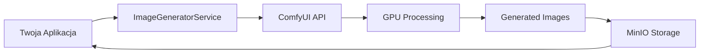
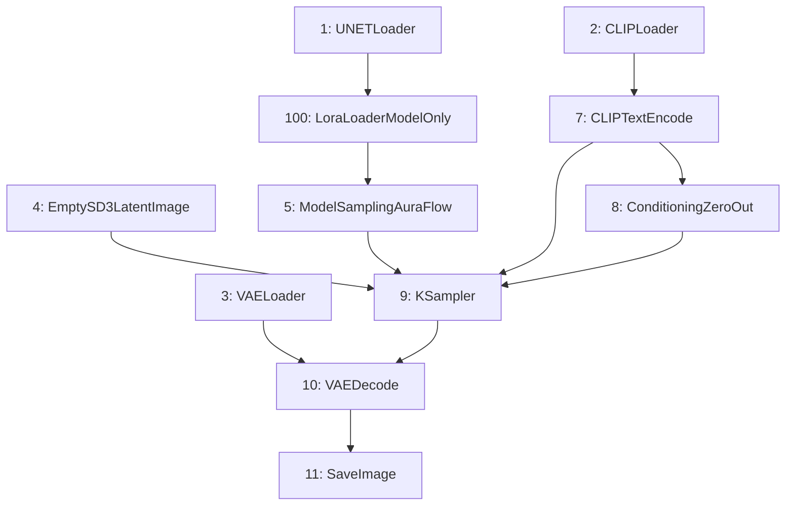

# ComfyUI Integration Guide - Pełna Dokumentacja

Ten dokument zawiera kompletną dokumentację integracji ComfyUI API do zewnętrznej aplikacji, obejmującą wszystkie endpointy, funkcje, konfigurację LoRA oraz ustawienia.

---

## 📋 Spis Treści

1. [Architektura Integracji](#architektura-integracji)
2. [Konfiguracja](#konfiguracja)
3. [Endpointy ComfyUI API](#endpointy-comfyui-api)
4. [Modele i Presety](#modele-i-presety)
5. [Konfiguracja LoRA](#konfiguracja-lora)
6. [Workflow i Nodes](#workflow-i-nodes)
7. [Implementacja w Python](#implementacja-w-python)
8. [Rozwiązywanie Problemów](#rozwiązywanie-problemów)

---

## Architektura Integracji



### Przepływ Danych

1. **Request** → Aplikacja wysyła request z promptem do `ImageGeneratorService`
2. **Build Workflow** → Serwis buduje JSON workflow dla ComfyUI
3. **Submit** → Workflow jest wysyłany do ComfyUI przez `POST /prompt`
4. **Poll** → Aplikacja odpytuje `GET /history/{prompt_id}` o status
5. **Download** → Po zakończeniu pobiera obraz przez `GET /view`
6. **Store** → Obraz jest uploadowany do MinIO
7. **Response** → URL obrazu jest zwracany do aplikacji

---

## Konfiguracja

### Zmienne Środowiskowe (`.env`)

```bash
# ComfyUI API URL
COMFYUI_API_URL=http://192.168.0.14:8188

# Polling Configuration
COMFYUI_POLLING_INTERVAL=10  # sekundy między sprawdzeniami statusu
COMFYUI_MAX_POLLING_TIME=3600  # maksymalny czas oczekiwania (1h)

# Z-Image LoRA Configuration
PHASE22_LORA_NAME=Z-image\Classic_Painting_Z_Image_Turbo_v1_renderartist_1750.safetensors
PHASE22_LORA_STRENGTH=1.0
```

### Konfiguracja Python (Pydantic Settings)

```python
from pydantic_settings import BaseSettings, Field

class Settings(BaseSettings):
    # ComfyUI Configuration
    comfyui_api_url: str = Field(
        default="http://192.168.0.14:8188",
        description="ComfyUI API URL"
    )
    comfyui_polling_interval: int = Field(default=10)
    comfyui_max_polling_time: int = Field(default=3600)
    
    # Z-Image LoRA
    z_image_lora_name: str = Field(
        default="",
        validation_alias="PHASE22_LORA_NAME"
    )
    z_image_lora_strength: float = Field(
        default=1.0,
        validation_alias="PHASE22_LORA_STRENGTH"
    )
```

---

## Endpointy ComfyUI API

### 1. Health Check - `GET /system_stats`

Sprawdza czy ComfyUI jest online i zwraca statystyki systemu.

**Request:**
```http
GET http://192.168.0.14:8188/system_stats
```

**Response (200 OK):**
```json
{
  "system": {
    "os": "posix",
    "python_version": "3.10.12",
    "embedded_python": false
  },
  "devices": [
    {
      "name": "cuda:0 NVIDIA GeForce RTX 4090",
      "type": "cuda",
      "vram_total": 25769803776,
      "vram_free": 20000000000,
      "torch_vram_total": 24000000000,
      "torch_vram_free": 18000000000
    }
  ]
}
```

### 2. Queue Status - `GET /queue`

Pobiera aktualny stan kolejki zadań.

**Request:**
```http
GET http://192.168.0.14:8188/queue
```

**Response:**
```json
{
  "queue_running": [
    [0, "abc123-def456", {"workflow": {...}}, {"extra": "data"}]
  ],
  "queue_pending": [
    [1, "xyz789-uvw012", {"workflow": {...}}, {"extra": "data"}]
  ]
}
```

**Struktura elementu kolejki:**
- `[0]` - pozycja w kolejce
- `[1]` - prompt_id
- `[2]` - workflow JSON
- `[3]` - dodatkowe dane

### 3. Submit Prompt - `POST /prompt`

Wysyła workflow do wykonania.

**Request:**
```http
POST http://192.168.0.14:8188/prompt
Content-Type: application/json

{
  "prompt": {
    "1": {"inputs": {...}, "class_type": "UNETLoader"},
    "2": {"inputs": {...}, "class_type": "CLIPLoader"},
    ...
  },
  "client_id": "my_app_scene_123"
}
```

**Response (200 OK):**
```json
{
  "prompt_id": "abc123-def456-ghi789",
  "number": 0,
  "node_errors": {}
}
```

**Error Response (400):**
```json
{
  "error": {
    "type": "prompt_error",
    "message": "Invalid node type: UnknownLoader",
    "details": {...}
  }
}
```

### 4. Check History - `GET /history/{prompt_id}`

Sprawdza status i wyniki zakończonego zadania.

**Request:**
```http
GET http://192.168.0.14:8188/history/abc123-def456-ghi789
```

**Response (Processing):**
```json
{
  "abc123-def456-ghi789": {
    "status": {
      "status_str": "processing",
      "completed": false
    },
    "outputs": {}
  }
}
```

**Response (Completed):**
```json
{
  "abc123-def456-ghi789": {
    "status": {
      "status_str": "success",
      "completed": true,
      "extra_info": {}
    },
    "outputs": {
      "11": {
        "images": [
          {
            "filename": "z_image_1.1_12345_00001.png",
            "subfolder": "",
            "type": "output"
          }
        ]
      }
    }
  }
}
```

### 5. View Image - `GET /view`

Pobiera wygenerowany obraz.

**Request:**
```http
GET http://192.168.0.14:8188/view?filename=z_image_1.1_12345_00001.png&type=output&subfolder=
```

**Response:**
- Content-Type: `image/png`
- Body: Binary image data

### 6. Interrupt - `POST /interrupt`

Przerywa aktualnie przetwarzane zadanie.

**Request:**
```http
POST http://192.168.0.14:8188/interrupt
```

**Response (200 OK):**
```json
{}
```

### 7. Clear Queue - `POST /queue`

Czyści kolejkę oczekujących zadań.

**Request:**
```http
POST http://192.168.0.14:8188/queue
Content-Type: application/json

{"clear": true}
```

### 8. Object Info - `GET /object_info`

Pobiera informacje o dostępnych node'ach i ich konfiguracji.

**Request:**
```http
GET http://192.168.0.14:8188/object_info
```

**Response (fragment):**
```json
{
  "LoraLoader": {
    "input": {
      "required": {
        "model": ["MODEL"],
        "clip": ["CLIP"],
        "lora_name": [["lora1.safetensors", "lora2.safetensors", ...]],
        "strength_model": ["FLOAT", {"default": 1.0, "min": -20.0, "max": 20.0}],
        "strength_clip": ["FLOAT", {"default": 1.0, "min": -20.0, "max": 20.0}]
      }
    },
    "output": ["MODEL", "CLIP"],
    "output_name": ["MODEL", "CLIP"],
    "name": "LoraLoader",
    "display_name": "Load LoRA",
    "category": "loaders"
  }
}
```

---

## Modele i Presety

### Dostępne Providery

| Provider | Opis | Czas/Obraz | Config Key |
|----------|------|------------|------------|
| `FLUX_DEV` | Flux Dev (High Quality) | 45-60s | `flux_dev` |
| `FLUX_KREA` | Flux Krea (Balanced) | 25-35s | `flux_krea` |
| `SDXL` | SDXL Base | 30-45s | `sdxl` |
| `SDXL_LORA` | SDXL + LoRA | 30-45s | `sdxl_lora` |
| `Z_IMAGE` | Z-Image Turbo (Fast) | 15-25s | `z_image` |

### Z-Image Preset (Rekomendowany)

```python
"z_image": {
    "name": "Z-Image (Thick Impasto Turbo)",
    "time_per_image": "15-25s",
    "workflow": {
        "1": {
            "inputs": {
                "unet_name": "zImageTurboFP8Kijai_fp8ScaledE4m3fn.safetensors",
                "weight_dtype": "default"
            },
            "class_type": "UNETLoader"
        },
        "2": {
            "inputs": {
                "clip_name": "qwen_3_4b.safetensors",
                "type": "lumina2",
                "device": "default"
            },
            "class_type": "CLIPLoader"
        },
        "3": {
            "inputs": {"vae_name": "ae.safetensors"},
            "class_type": "VAELoader"
        },
        "4": {
            "inputs": {
                "width": 1344,
                "height": 768,
                "batch_size": 1
            },
            "class_type": "EmptySD3LatentImage"
        },
        "5": {
            "inputs": {
                "shift": 3,
                "model": ["1", 0]  # będzie zmienione jeśli LoRA jest użyte
            },
            "class_type": "ModelSamplingAuraFlow"
        },
        "7": {
            "inputs": {
                "text": "{{POSITIVE_PROMPT}}",
                "clip": ["2", 0]
            },
            "class_type": "CLIPTextEncode"
        },
        "8": {
            "inputs": {"conditioning": ["7", 0]},
            "class_type": "ConditioningZeroOut"  # Negative prompt
        },
        "9": {
            "inputs": {
                "seed": 0,  # będzie losowy
                "steps": 8,
                "cfg": 1.5,
                "sampler_name": "dpmpp_2m_sde",
                "scheduler": "simple",
                "denoise": 1,
                "model": ["5", 0],
                "positive": ["7", 0],
                "negative": ["8", 0],
                "latent_image": ["4", 0]
            },
            "class_type": "KSampler"
        },
        "10": {
            "inputs": {
                "samples": ["9", 0],
                "vae": ["3", 0]
            },
            "class_type": "VAEDecode"
        },
        "11": {
            "inputs": {
                "filename_prefix": "z_image_{{SCENE_NUMBER}}_{{SCENE_ID}}_",
                "images": ["10", 0]
            },
            "class_type": "SaveImage"
        }
    }
}
```

### FLUX Preset

```python
"flux_krea": {
    "name": "Flux Krea (Balanced Master Painter)",
    "time_per_image": "25-35s",
    "workflow": {
        "1": {"inputs": {"unet_name": "flux1-dev.safetensors", "weight_dtype": "fp8_e4m3fn_fast"}, "class_type": "UNETLoader"},
        "2": {"inputs": {"clip_name1": "ViT-L-14-TEXT-detail-improved-hiT-GmP-TE-only-HF.safetensors", "clip_name2": "t5xxl_fp16.safetensors", "type": "flux", "device": "default"}, "class_type": "DualCLIPLoader"},
        "3": {"inputs": {"vae_name": "ae.safetensors"}, "class_type": "VAELoader"},
        "4": {"inputs": {"width": 1344, "height": 768, "batch_size": 1}, "class_type": "EmptySD3LatentImage"},
        "5": {"inputs": {"lora_name": "flux_turbo_v1_1.safetensors", "strength_model": 1, "strength_clip": 1, "model": ["1", 0], "clip": ["2", 0]}, "class_type": "LoraLoader"},
        "6": {"inputs": {"lora_name": "VibrantOilPainting.safetensors", "strength_model": 1, "strength_clip": 1, "model": ["5", 0], "clip": ["5", 1]}, "class_type": "LoraLoader"},
        "7": {"inputs": {"text": "{{POSITIVE_PROMPT}}", "clip": ["6", 1]}, "class_type": "CLIPTextEncode"},
        "8": {"inputs": {"text": "{{NEGATIVE_PROMPT}}", "clip": ["6", 1]}, "class_type": "CLIPTextEncode"},
        "9": {"inputs": {"seed": 0, "steps": 20, "cfg": 3.6, "sampler_name": "euler", "scheduler": "normal", "denoise": 1, "model": ["6", 0], "positive": ["7", 0], "negative": ["8", 0], "latent_image": ["4", 0]}, "class_type": "KSampler"},
        "10": {"inputs": {"samples": ["9", 0], "vae": ["3", 0]}, "class_type": "VAEDecode"},
        "11": {"inputs": {"filename_prefix": "flux_krea_{{STYLE_NAME}}_{{SCENE_ID}}_", "images": ["10", 0]}, "class_type": "SaveImage"}
    }
}
```

---

## Konfiguracja LoRA

### Typy LoRA Loaderów

| Node Type | Opis | Połączenia |
|-----------|------|------------|
| `LoraLoader` | Ładuje LoRA dla modelu i CLIP | Model + CLIP input/output |
| `LoraLoaderModelOnly` | Ładuje LoRA tylko dla modelu | Model input/output |

### Parametry LoRA

```python
{
    "lora_name": "VibrantOilPainting.safetensors",  # Nazwa pliku LoRA
    "strength_model": 1.0,  # -20.0 do 20.0, domyślnie 1.0
    "strength_clip": 1.0,   # -20.0 do 20.0, domyślnie 1.0 (tylko LoraLoader)
    "model": ["previous_node", 0],  # Input: MODEL
    "clip": ["previous_node", 1]    # Input: CLIP (tylko LoraLoader)
}
```

### Dynamiczne Dodawanie LoRA (Multi-LoRA Chain)

```python
def add_loras_to_workflow(workflow: dict, loras: List[str], strength: float = 1.0):
    """Dodaje chain LoRA do workflow Z-Image."""
    
    if not loras:
        # Bez LoRA: UNET (node 1) -> ModelSamplingAuraFlow (node 5)
        workflow["5"]["inputs"]["model"] = ["1", 0]
        return workflow
    
    last_node_id = "1"  # Start od UNETLoader
    
    for i, lora_path in enumerate(loras):
        node_id = str(100 + i)  # IDs: 100, 101, 102, ...
        
        workflow[node_id] = {
            "inputs": {
                "lora_name": lora_path,
                "strength_model": strength,
                "model": [last_node_id, 0]
            },
            "class_type": "LoraLoaderModelOnly"
        }
        last_node_id = node_id
    
    # Ostatnia LoRA -> ModelSamplingAuraFlow (node 5)
    workflow["5"]["inputs"]["model"] = [last_node_id, 0]
    
    return workflow
```

### Dostępne LoRA Oil Painting

| Nazwa | Styl | Siła |
|-------|------|------|
| `VibrantOilPainting.safetensors` | Wibrujące kolory | 1.0 |
| `Classic_Painting_Z_Image_Turbo_v1_renderartist_1750.safetensors` | Klasyczne malarstwo | 1.0 |
| `Oil Painting Style.safetensors` | Ogólny styl olejny | 0.8-1.0 |
| `Italian Baroque Caravaggio Oil Painting.safetensors` | Barokowy | 0.8-1.0 |

---

## Workflow i Nodes

### Mapa Połączeń (Z-Image)



### Referencje Nodes

Połączenia w workflow używają formatu `["node_id", output_index]`:

```python
# Połączenie do node 1, output 0 (MODEL)
"model": ["1", 0]

# Połączenie do node 2, output 0 (CLIP)
"clip": ["2", 0]

# Połączenie do node 5, output 1 (drugi output)
"model": ["5", 1]
```

### Kluczowe Parametry KSampler

| Parametr | Z-Image | FLUX | SDXL |
|----------|---------|------|------|
| `steps` | 8 | 20 | 20 |
| `cfg` | 1.5 | 3.6 | 7.0 |
| `sampler_name` | dpmpp_2m_sde | euler | euler |
| `scheduler` | simple | normal | normal |

---

## Implementacja w Python

### Pełny Przykład Serwisu

```python
import asyncio
import httpx
import json
import random
from typing import Optional, List, Dict, Any
from pydantic import BaseModel, Field
from enum import Enum


class ImageProvider(str, Enum):
    FLUX_DEV = "Flux Dev"
    FLUX_KREA = "Flux Krea"
    SDXL = "SDXL"
    SDXL_LORA = "SDXL Lora"
    Z_IMAGE = "Z-Image"


class ImageGenerateRequest(BaseModel):
    scene_id: int
    positive_prompt: str
    negative_prompt: str = "blurry, low quality, text, watermark"
    image_provider: ImageProvider = ImageProvider.Z_IMAGE
    lora_names: Optional[List[str]] = None
    width: int = 1344
    height: int = 768
    batch_size: int = 1


class ImageStatusResponse(BaseModel):
    prompt_id: str
    status: str
    ready: bool
    filename: Optional[str] = None
    image_url: Optional[str] = None
    image_urls: List[str] = Field(default_factory=list)


class ComfyUIClient:
    """Klient do komunikacji z ComfyUI API."""
    
    def __init__(self, base_url: str = "http://192.168.0.14:8188"):
        self.base_url = base_url
    
    async def check_health(self) -> bool:
        """Sprawdza czy ComfyUI jest online."""
        try:
            async with httpx.AsyncClient(timeout=5.0) as client:
                response = await client.get(f"{self.base_url}/system_stats")
                return response.status_code == 200
        except Exception:
            return False
    
    async def get_queue_status(self) -> Dict[str, Any]:
        """Pobiera status kolejki."""
        async with httpx.AsyncClient(timeout=10.0) as client:
            response = await client.get(f"{self.base_url}/queue")
            response.raise_for_status()
            return response.json()
    
    async def submit_prompt(self, workflow: Dict, client_id: str) -> str:
        """Wysyła workflow do ComfyUI. Zwraca prompt_id."""
        async with httpx.AsyncClient(timeout=120.0) as client:
            response = await client.post(
                f"{self.base_url}/prompt",
                json={"prompt": workflow, "client_id": client_id}
            )
            response.raise_for_status()
            result = response.json()
            return result["prompt_id"]
    
    async def check_status(self, prompt_id: str) -> ImageStatusResponse:
        """Sprawdza status zadania."""
        async with httpx.AsyncClient(timeout=30.0) as client:
            # Check queue first
            queue_response = await client.get(f"{self.base_url}/queue")
            queue_data = queue_response.json()
            
            for item in queue_data.get("queue_running", []):
                if item[1] == prompt_id:
                    return ImageStatusResponse(
                        prompt_id=prompt_id,
                        status="processing",
                        ready=False
                    )
            
            for item in queue_data.get("queue_pending", []):
                if item[1] == prompt_id:
                    return ImageStatusResponse(
                        prompt_id=prompt_id,
                        status="pending",
                        ready=False
                    )
            
            # Check history
            history_response = await client.get(f"{self.base_url}/history/{prompt_id}")
            history_data = history_response.json()
            
            prompt_data = history_data.get(prompt_id)
            if not prompt_data:
                return ImageStatusResponse(
                    prompt_id=prompt_id,
                    status="not_found",
                    ready=False
                )
            
            status = prompt_data.get("status", {})
            if not status.get("completed"):
                return ImageStatusResponse(
                    prompt_id=prompt_id,
                    status=status.get("status_str", "processing"),
                    ready=False
                )
            
            # Get images from outputs
            outputs = prompt_data.get("outputs", {})
            image_urls = []
            first_filename = None
            
            for node_id in ["11", "10", "9", "8", "7"]:
                if node_id in outputs and "images" in outputs[node_id]:
                    for img in outputs[node_id]["images"]:
                        filename = img.get("filename", "")
                        subfolder = img.get("subfolder", "")
                        if not first_filename:
                            first_filename = filename
                        url = f"{self.base_url}/view?filename={filename}&type=output"
                        if subfolder:
                            url += f"&subfolder={subfolder}"
                        image_urls.append(url)
                    break
            
            return ImageStatusResponse(
                prompt_id=prompt_id,
                status="completed",
                ready=True,
                filename=first_filename,
                image_url=image_urls[0] if image_urls else None,
                image_urls=image_urls
            )
    
    async def download_image(self, image_url: str) -> bytes:
        """Pobiera obraz z ComfyUI."""
        async with httpx.AsyncClient(timeout=60.0) as client:
            response = await client.get(image_url)
            response.raise_for_status()
            return response.content
    
    async def interrupt(self) -> bool:
        """Przerywa aktualnie przetwarzane zadanie."""
        try:
            async with httpx.AsyncClient(timeout=10.0) as client:
                await client.post(f"{self.base_url}/interrupt")
                return True
        except Exception:
            return False
    
    async def clear_queue(self) -> bool:
        """Czyści kolejkę oczekujących zadań."""
        try:
            async with httpx.AsyncClient(timeout=10.0) as client:
                await client.post(f"{self.base_url}/queue", json={"clear": True})
                return True
        except Exception:
            return False
    
    async def get_available_loras(self) -> List[str]:
        """Pobiera listę dostępnych LoRA."""
        try:
            async with httpx.AsyncClient(timeout=10.0) as client:
                response = await client.get(f"{self.base_url}/object_info")
                response.raise_for_status()
                data = response.json()
                
                loras = []
                for node_type in ["LoraLoader", "LoraLoaderModelOnly"]:
                    if node_type in data:
                        node_loras = data[node_type]["input"]["required"]["lora_name"][0]
                        loras.extend(node_loras)
                
                return sorted(list(set(loras)))
        except Exception:
            return []


class ImageGeneratorService:
    """Serwis do generowania obrazów."""
    
    MODEL_CONFIGS = {
        "z_image": {
            "name": "Z-Image (Thick Impasto Turbo)",
            "time_per_image": "15-25s",
            "workflow": {
                "1": {"inputs": {"unet_name": "zImageTurboFP8Kijai_fp8ScaledE4m3fn.safetensors", "weight_dtype": "default"}, "class_type": "UNETLoader"},
                "2": {"inputs": {"clip_name": "qwen_3_4b.safetensors", "type": "lumina2", "device": "default"}, "class_type": "CLIPLoader"},
                "3": {"inputs": {"vae_name": "ae.safetensors"}, "class_type": "VAELoader"},
                "4": {"inputs": {"width": 1344, "height": 768, "batch_size": 1}, "class_type": "EmptySD3LatentImage"},
                "5": {"inputs": {"shift": 3, "model": ["1", 0]}, "class_type": "ModelSamplingAuraFlow"},
                "7": {"inputs": {"text": "{{POSITIVE_PROMPT}}", "clip": ["2", 0]}, "class_type": "CLIPTextEncode"},
                "8": {"inputs": {"conditioning": ["7", 0]}, "class_type": "ConditioningZeroOut"},
                "9": {"inputs": {"seed": 0, "steps": 8, "cfg": 1.5, "sampler_name": "dpmpp_2m_sde", "scheduler": "simple", "denoise": 1, "model": ["5", 0], "positive": ["7", 0], "negative": ["8", 0], "latent_image": ["4", 0]}, "class_type": "KSampler"},
                "10": {"inputs": {"samples": ["9", 0], "vae": ["3", 0]}, "class_type": "VAEDecode"},
                "11": {"inputs": {"filename_prefix": "z_image_", "images": ["10", 0]}, "class_type": "SaveImage"}
            }
        }
    }
    
    PROVIDER_MAP = {
        ImageProvider.Z_IMAGE: "z_image",
        # Dodaj pozostałe providery...
    }
    
    def __init__(self, comfyui_url: str = "http://192.168.0.14:8188"):
        self.client = ComfyUIClient(comfyui_url)
        self.comfyui_url = comfyui_url
    
    def _build_workflow(self, request: ImageGenerateRequest) -> Dict[str, Any]:
        """Buduje workflow z requestu."""
        config_key = self.PROVIDER_MAP.get(request.image_provider, "z_image")
        model_config = self.MODEL_CONFIGS[config_key]
        
        # Deep copy workflow
        workflow = json.loads(json.dumps(model_config["workflow"]))
        
        # Replace placeholders
        workflow_str = json.dumps(workflow)
        workflow_str = workflow_str.replace("{{POSITIVE_PROMPT}}", request.positive_prompt)
        workflow = json.loads(workflow_str)
        
        # Update dimensions
        if "4" in workflow:
            workflow["4"]["inputs"]["width"] = request.width
            workflow["4"]["inputs"]["height"] = request.height
            workflow["4"]["inputs"]["batch_size"] = request.batch_size
        
        # Update seed
        random_seed = random.randint(0, 2**53 - 1)
        if "9" in workflow:
            workflow["9"]["inputs"]["seed"] = random_seed
        
        # Add LoRAs dynamically
        if request.lora_names:
            last_node_id = "1"
            for i, lora_name in enumerate(request.lora_names):
                node_id = str(100 + i)
                workflow[node_id] = {
                    "inputs": {
                        "lora_name": lora_name,
                        "strength_model": 1.0,
                        "model": [last_node_id, 0]
                    },
                    "class_type": "LoraLoaderModelOnly"
                }
                last_node_id = node_id
            
            # Update ModelSamplingAuraFlow to use last LoRA
            if "5" in workflow:
                workflow["5"]["inputs"]["model"] = [last_node_id, 0]
        
        return workflow
    
    async def generate(self, request: ImageGenerateRequest) -> str:
        """Generuje obraz. Zwraca prompt_id."""
        if not await self.client.check_health():
            raise Exception("ComfyUI is not available")
        
        workflow = self._build_workflow(request)
        client_id = f"app_{request.scene_id}_{random.randint(0, 9999)}"
        
        prompt_id = await self.client.submit_prompt(workflow, client_id)
        return prompt_id
    
    async def wait_for_result(
        self, 
        prompt_id: str, 
        timeout: int = 300, 
        poll_interval: int = 5
    ) -> ImageStatusResponse:
        """Czeka na zakończenie generacji."""
        start_time = asyncio.get_event_loop().time()
        
        while True:
            elapsed = asyncio.get_event_loop().time() - start_time
            if elapsed > timeout:
                raise TimeoutError(f"Generation timed out after {timeout}s")
            
            status = await self.client.check_status(prompt_id)
            if status.ready:
                return status
            
            if status.status == "error":
                raise Exception(f"Generation failed: {status.status}")
            
            await asyncio.sleep(poll_interval)


# Przykład użycia
async def main():
    service = ImageGeneratorService("http://192.168.0.14:8188")
    
    # Lista dostępnych LoRA
    loras = await service.client.get_available_loras()
    print(f"Available LoRAs: {loras[:5]}...")
    
    # Generuj obraz
    request = ImageGenerateRequest(
        scene_id=123,
        positive_prompt="A beautiful oil painting of a sunset over mountains, vibrant colors, thick impasto brush strokes",
        lora_names=["VibrantOilPainting.safetensors"],
        width=1344,
        height=768
    )
    
    prompt_id = await service.generate(request)
    print(f"Generation started: {prompt_id}")
    
    # Czekaj na wynik
    result = await service.wait_for_result(prompt_id, timeout=120)
    print(f"Generation complete: {result.image_url}")
    
    # Pobierz obraz
    if result.image_url:
        image_data = await service.client.download_image(result.image_url)
        with open("output.png", "wb") as f:
            f.write(image_data)
        print(f"Image saved: output.png ({len(image_data) // 1024} KB)")


if __name__ == "__main__":
    asyncio.run(main())
```

---

## Rozwiązywanie Problemów

### Problem: ComfyUI nie odpowiada

**Objawy:** `check_health()` zwraca `False`, timeout na wszystkich requestach

**Rozwiązanie:**
1. Sprawdź czy ComfyUI jest uruchomiony: `curl http://192.168.0.14:8188/system_stats`
2. Sprawdź firewall/sieć
3. Zrestartuj ComfyUI

### Problem: LoRA nie jest ładowana

**Objawy:** Obrazy bez efektu stylu LoRA

**Rozwiązanie:**
1. Sprawdź dokładną nazwę LoRA: `GET /object_info` → `LoraLoader` → `lora_name`
2. Upewnij się że ścieżka jest poprawna (niektóre LoRA są w podfolderach: `FLUX\VibrantOilPainting.safetensors`)
3. Sprawdź logi ComfyUI

### Problem: Generacja trwa zbyt długo

**Objawy:** Generacja trwa > 2 minuty

**Rozwiązanie:**
1. Zmniejsz liczbę `steps` (Z-Image: 8, FLUX: 15-20)
2. Zmniejsz rozdzielczość
3. Sprawdź czy GPU nie jest zajęte innymi procesami

### Problem: Uszkodzone obrazy

**Objawy:** Wygenerowane obrazy mają < 20KB

**Rozwiązanie:**
1. Sprawdź dostępność RAM GPU
2. Zmniejsz `batch_size`
3. Zrestartuj ComfyUI

### Problem: "unet missing: ['norm_final.weight']"

**Objawy:** Ostrzeżenie w logach ComfyUI

**Rozwiązanie:**
- To jest ostrzeżenie, nie błąd - można zignorować jeśli generacja działa

---

## Podsumowanie

| Aspekt | Wartość |
|--------|---------|
| **Base URL** | `http://192.168.0.14:8188` |
| **Submit Endpoint** | `POST /prompt` |
| **Status Endpoint** | `GET /history/{prompt_id}` |
| **Image Endpoint** | `GET /view?filename=...` |
| **Polling Interval** | 5-10 sekund |
| **Default Provider** | Z-Image (8 steps, CFG 1.5) |
| **Recommended LoRA Strength** | 1.0 |

---

*Dokumentacja wygenerowana na podstawie analizy kodu projektu FILM.*
