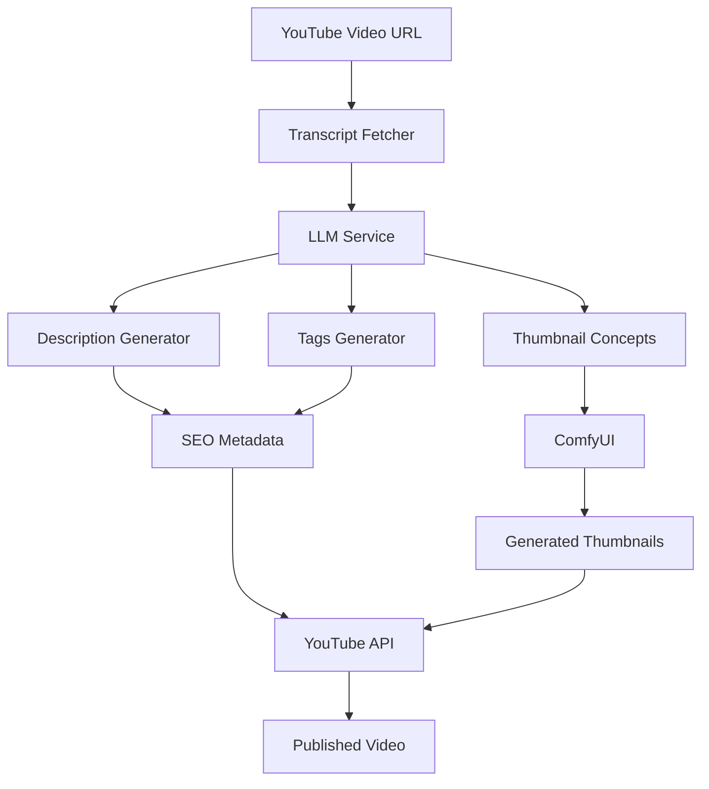
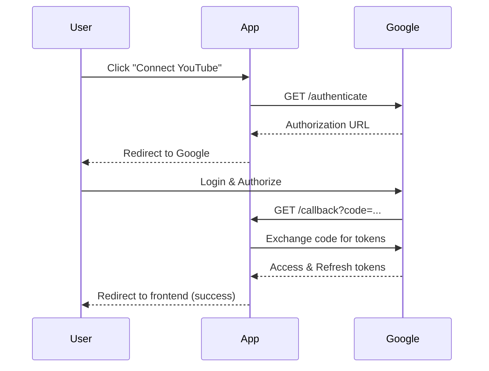

# YouTube Integration Guide - Pełna Dokumentacja

Ten dokument zawiera kompletną dokumentację integracji YouTube API do zewnętrznej aplikacji, obejmującą pobieranie transkryptów, generowanie metadanych SEO, tworzenie miniatur i upload do YouTube.

---

## 📋 Spis Treści

1. [Architektura Systemu](#architektura-systemu)
2. [Konfiguracja](#konfiguracja)
3. [Pobieranie Transkryptu z YouTube](#pobieranie-transkryptu-z-youtube)
4. [Generowanie Metadanych SEO](#generowanie-metadanych-seo)
5. [Generowanie Miniatur](#generowanie-miniatur)
6. [YouTube Data API v3](#youtube-data-api-v3)
7. [Niezależna Aplikacja - Specyfikacja](#niezależna-aplikacja---specyfikacja)
8. [Przykłady Implementacji](#przykłady-implementacji)

---

## Architektura Systemu



### Komponenty

| Komponent | Opis | Technologia |
|-----------|------|-------------|
| **Transcript Fetcher** | Pobiera transkrypt z YouTube | youtube-transcript-api |
| **LLM Service** | Generuje opisy i tagi SEO | OpenRouter API (Gemini 2.5 Flash) |
| **YouTubeService** | Orchestracja generowania metadanych | Python/FastAPI |
| **ComfyUI** | Generowanie miniatur | Z-Image Turbo + LoRA |
| **YouTube API** | Upload i update metadanych | YouTube Data API v3 |

---

## Konfiguracja

### Zmienne Środowiskowe (`.env`)

```bash
# YouTube Data API (Read operations - API Key)
YOUTUBE_API_KEY=AIzaSy...your_api_key...

# YouTube OAuth 2.0 (Write operations - update video, upload)
YOUTUBE_CLIENT_ID=1234567890-abc.apps.googleusercontent.com
YOUTUBE_CLIENT_SECRET=GOCSPX-...secret...
YOUTUBE_REDIRECT_URI=http://127.0.0.1:8008/api/v1/youtube/callback
YOUTUBE_SCOPES=https://www.googleapis.com/auth/youtube.force-ssl

# LLM for metadata generation
OPENROUTER_API_KEY=sk-or-v1-...
OPENROUTER_MODEL_PRIMARY=google/gemini-2.5-flash

# ComfyUI for thumbnails
COMFYUI_API_URL=http://192.168.0.14:8188
```

### Python Configuration (Pydantic)

```python
from pydantic_settings import BaseSettings, Field

class Settings(BaseSettings):
    # YouTube API
    youtube_api_key: Optional[str] = Field(default=None)
    youtube_client_id: Optional[str] = Field(default=None)
    youtube_client_secret: Optional[str] = Field(default=None)
    youtube_redirect_uri: str = Field(
        default="http://127.0.0.1:8001/api/v1/youtube/callback"
    )
    youtube_scopes: str = Field(
        default="https://www.googleapis.com/auth/youtube.force-ssl"
    )
    
    # LLM
    openrouter_api_key: str
    openrouter_model_primary: str = Field(default="google/gemini-2.5-flash")
    
    # ComfyUI
    comfyui_api_url: str = Field(default="http://192.168.0.14:8188")
```

---

## Pobieranie Transkryptu z YouTube

### Biblioteka: `youtube-transcript-api`

```bash
pip install youtube-transcript-api
```

### Implementacja

```python
from youtube_transcript_api import YouTubeTranscriptApi
from typing import Optional, List, Dict, Any

class YouTubeTranscriptFetcher:
    """Fetcher for YouTube video transcripts."""
    
    @staticmethod
    def extract_video_id(url: str) -> Optional[str]:
        """Extract video ID from YouTube URL."""
        import re
        patterns = [
            r'(?:youtube\.com\/watch\?v=|youtu\.be\/|youtube\.com\/embed\/)([a-zA-Z0-9_-]{11})',
        ]
        for pattern in patterns:
            match = re.search(pattern, url)
            if match:
                return match.group(1)
        
        # Check if it's already a video ID
        if len(url) == 11 and url.replace('-', '').replace('_', '').isalnum():
            return url
        return None
    
    @staticmethod
    def fetch_transcript(
        video_id: str,
        languages: List[str] = ['en', 'pl', 'en-US', 'en-GB']
    ) -> Optional[Dict[str, Any]]:
        """
        Fetch transcript from YouTube video.
        
        Args:
            video_id: YouTube video ID
            languages: Preferred languages (in order of preference)
            
        Returns:
            Dict with transcript data or None if not available
        """
        try:
            # Try to get transcript in preferred languages
            transcript_list = YouTubeTranscriptApi.list_transcripts(video_id)
            
            # Try manual transcripts first (more accurate)
            for lang in languages:
                try:
                    transcript = transcript_list.find_manually_created_transcript([lang])
                    entries = transcript.fetch()
                    return {
                        "video_id": video_id,
                        "language": lang,
                        "type": "manual",
                        "entries": entries,
                        "full_text": " ".join([e['text'] for e in entries])
                    }
                except:
                    continue
            
            # Fallback to auto-generated transcripts
            for lang in languages:
                try:
                    transcript = transcript_list.find_generated_transcript([lang])
                    entries = transcript.fetch()
                    return {
                        "video_id": video_id,
                        "language": lang,
                        "type": "auto-generated",
                        "entries": entries,
                        "full_text": " ".join([e['text'] for e in entries])
                    }
                except:
                    continue
            
            # Last resort: get any available transcript
            for transcript in transcript_list:
                entries = transcript.fetch()
                return {
                    "video_id": video_id,
                    "language": transcript.language_code,
                    "type": "auto-generated" if transcript.is_generated else "manual",
                    "entries": entries,
                    "full_text": " ".join([e['text'] for e in entries])
                }
                
        except Exception as e:
            print(f"Error fetching transcript: {e}")
            return None
        
        return None


# Przykład użycia
fetcher = YouTubeTranscriptFetcher()
video_id = fetcher.extract_video_id("https://www.youtube.com/watch?v=dQw4w9WgXcQ")
transcript = fetcher.fetch_transcript(video_id)

if transcript:
    print(f"Transcript ({transcript['language']}, {transcript['type']}):")
    print(transcript['full_text'][:500])
```

---

## Generowanie Metadanych SEO

### Prompt dla Opisu (SEO-Optimized)

System wykorzystuje LLM do generowania opisów zoptymalizowanych pod kątem SEO YouTube.

#### Kluczowe Elementy Promptu

```python
DESCRIPTION_SYSTEM_PROMPT = """You are a YouTube SEO specialist and content expert. 
Your goal is to create video descriptions that rank high in YouTube search results 
while engaging viewers. You understand that the first 150 characters determine 
visibility in search results."""

DESCRIPTION_USER_PROMPT = """
Generate a YouTube video description for a documentary film with MAXIMUM SEO impact.

=== CRITICAL: FIRST 150 CHARACTERS ===
This appears in YouTube search results. Structure it EXACTLY like this:

[PRIMARY_KEYWORD] | [Hook question or bold statement] - [Value/Benefit to viewer]

EXAMPLES:
"Money History | How did currency actually begin? Discover the evolution that shaped civilization."
"Bitcoin Documentary | What if everything you knew about money was wrong? Learn the truth."

Your first line MUST:
- Start with primary keyword (e.g., "Money History", "Bitcoin Documentary")
- Include compelling question OR bold statement
- Promise specific value (Learn/Discover/Understand...)
- Stay under 150 characters total
- Be click-worthy for someone searching on YouTube

=== FULL DESCRIPTION STRUCTURE ===

SECTION 1 - SEO Hook (First line, 0-150 characters):
[PRIMARY_KEYWORD] | [Compelling hook] - [Clear benefit]

SECTION 2 - Video Chapters:
IN THIS EPISODE:
{chapters_text}

SECTION 3 - What You'll Learn (6-8 specific bullet points):
KEY TAKEAWAYS:
- [Specific learning point 1]
- [Specific learning point 2]
...

SECTION 4 - Full Story & Context (200-350 words):
[Tell engaging story about the topic]
[Include interesting facts, statistics, real-world applications]
[Weave in secondary keywords naturally 2-3 times]

SECTION 5 - Hashtags (5-7):
#MoneyDocumentary #[topic_specific] #Documentary

SECTION 6 - Sources:
{sources}

SECTION 7 - Call-to-Action:
SUBSCRIBE for more documentaries - new episodes weekly!
What surprised you most? COMMENT below!

=== INPUT VARIABLES ===
Title: {title}
Topic: {topic}
Primary Keyword: {primary_keyword}
Secondary Keywords: {secondary_keywords}
Research Summary: {research}
Script Excerpt: {script}

=== REQUIREMENTS ===
- Primary keyword: First line + Section 4 + Hashtags
- NO keyword stuffing - human-first, SEO-second
- Language: English
- Total length: Under 5000 characters
"""
```

### Prompt dla Tagów

```python
TAGS_SYSTEM_PROMPT = """You are a YouTube SEO specialist who creates effective 
video tags based on keyword research and competitor analysis."""

TAGS_USER_PROMPT = """
Generate YouTube video tags using this 5-TIER approach:

=== YOUR INPUTS ===
Title: {title}
Topic: {topic}
Key Themes: {research_summary}

=== TAG STRATEGY ===

TIER 1 - BRAND & FORMAT (2 tags):
- #MoneyDocumentary (channel brand)
- #Documentary

TIER 2 - PRIMARY KEYWORDS (4-5 tags):
- Main topic with high search volume
- Include variants: [topic] + "Explained", "History", "Guide"

TIER 3 - SECONDARY TOPICS (3-4 tags):
- Related broader concepts
- Examples: #Economics, #Finance, #Banking

TIER 4 - NICHE/LONG-TAIL (3-4 tags):
- Specific aspects (easier to rank)

TIER 5 - ENGAGEMENT (1-2 tags):
- Discovery tags: #EducationalVideo, #MustWatch

=== REQUIREMENTS ===
- Generate EXACTLY {max_tags} tags
- Each tag max 30 characters
- Total length max 500 characters
- NO duplicates
- Format: Comma-separated with hashtags

Generate {max_tags} SEO-optimized tags now:
"""
```

### Implementacja Serwisu

```python
import httpx
from typing import Dict, Any, List, Optional

class YouTubeMetadataService:
    """Service for generating YouTube metadata using LLM."""
    
    def __init__(self, openrouter_api_key: str, model: str = "google/gemini-2.5-flash"):
        self.api_key = openrouter_api_key
        self.model = model
        self.base_url = "https://openrouter.ai/api/v1"
    
    async def _call_llm(self, prompt: str, system_prompt: str) -> str:
        """Call LLM API."""
        async with httpx.AsyncClient(timeout=60.0) as client:
            response = await client.post(
                f"{self.base_url}/chat/completions",
                headers={
                    "Authorization": f"Bearer {self.api_key}",
                    "Content-Type": "application/json",
                    "HTTP-Referer": "http://localhost:8001",
                    "X-Title": "YouTube Metadata Generator"
                },
                json={
                    "model": self.model,
                    "messages": [
                        {"role": "system", "content": system_prompt},
                        {"role": "user", "content": prompt}
                    ],
                    "max_tokens": 4000,
                    "temperature": 0.7
                }
            )
            response.raise_for_status()
            data = response.json()
            return data["choices"][0]["message"]["content"]
    
    async def generate_description(
        self,
        title: str,
        topic: str,
        transcript: str,
        chapters: Optional[List[Dict[str, Any]]] = None,
        primary_keyword: Optional[str] = None,
        secondary_keywords: Optional[str] = None,
        max_length: int = 5000
    ) -> str:
        """Generate SEO-optimized description."""
        
        # Format chapters
        chapters_text = ""
        if chapters:
            chapters_text = "\n".join([
                f"{self._format_timestamp(c.get('start_time', 0))} {c.get('title', '')}"
                for c in chapters
            ])
        
        # Extract keywords if not provided
        if not primary_keyword:
            primary_keyword = " ".join(topic.split()[:3])
        if not secondary_keywords:
            secondary_keywords = f"{topic}, documentary, explained, history"
        
        # Truncate transcript
        transcript_excerpt = transcript[:2000] if len(transcript) > 2000 else transcript
        
        prompt = DESCRIPTION_USER_PROMPT.format(
            title=title,
            topic=topic,
            primary_keyword=primary_keyword,
            secondary_keywords=secondary_keywords,
            research=transcript_excerpt,
            script=transcript_excerpt[:1000],
            chapters_text=chapters_text or "00:00 Introduction",
            sources="Sources provided in video"
        )
        
        description = await self._call_llm(prompt, DESCRIPTION_SYSTEM_PROMPT)
        
        # Truncate if too long
        if len(description) > max_length:
            description = description[:max_length].rsplit(".", 1)[0] + "."
        
        return description.strip()
    
    async def generate_tags(
        self,
        title: str,
        topic: str,
        transcript: str,
        max_tags: int = 20
    ) -> List[str]:
        """Generate SEO-optimized tags."""
        
        transcript_summary = transcript[:1000] if len(transcript) > 1000 else transcript
        
        prompt = TAGS_USER_PROMPT.format(
            title=title,
            topic=topic,
            research_summary=transcript_summary,
            max_tags=max_tags
        )
        
        tags_str = await self._call_llm(prompt, TAGS_SYSTEM_PROMPT)
        
        # Parse tags
        tags = [tag.strip() for tag in tags_str.split(",") if tag.strip()]
        
        # Ensure channel tag is first
        channel_tag = "#MoneyDocumentary"
        unique_tags = [channel_tag]
        seen = {channel_tag.lower()}
        
        for tag in tags:
            tag_lower = tag.lower()
            if tag_lower not in seen and len(tag) <= 30:
                unique_tags.append(tag)
                seen.add(tag_lower)
                if len(unique_tags) >= max_tags:
                    break
        
        # Ensure total length under 500 chars
        while sum(len(tag) + 1 for tag in unique_tags) > 500 and len(unique_tags) > 1:
            unique_tags.pop()
        
        return unique_tags
    
    @staticmethod
    def _format_timestamp(seconds: float) -> str:
        """Format seconds to MM:SS or HH:MM:SS."""
        hours = int(seconds // 3600)
        minutes = int((seconds % 3600) // 60)
        secs = int(seconds % 60)
        
        if hours > 0:
            return f"{hours:02d}:{minutes:02d}:{secs:02d}"
        return f"{minutes:02d}:{secs:02d}"
```

---

## Generowanie Miniatur

### Prompt dla Konceptów Miniatur

```python
THUMBNAIL_SYSTEM_PROMPT = """You are a Vintage Visual Director specializing in 
circa 1900 photography aesthetics. You ONLY create prompts in grainy sepia 
vintage style with selective color. You NEVER use modern CGI or hyper-realistic styles."""

THUMBNAIL_USER_PROMPT = """
Generate 9 YouTube thumbnail concepts.

VIDEO TOPIC: {title}
THEME: {topic}

MANDATORY METAPHOR ("THE PUPPET MASTER"):
- The GIGANTIC FIGURE must be a specific person or personified institution
- The TINY SUBJECTS must be specific to the topic
- The INTERACTION must show control, oppression, or manipulation

MASTER STYLE:
A conceptual, vintage-style photograph from circa 1900. The image has a grainy 
texture, sepia tones, and muted deep colors. Dramatic, high-contrast chiaroscuro 
lighting creates deep shadows. A gigantic, dominating figure looms over tiny subjects.

RETURN A JSON LIST OF 9 OBJECTS:
- title: Short catchy name (max 3 words)
- prompt: Full visual prompt for image generation
- text_overlay: 1-3 punchy words (ALL CAPS)
- rationale: One sentence explanation

JSON Format:
[
  {"title": "...", "prompt": "...", "text_overlay": "...", "rationale": "..."},
  ...
]
"""
```

### Integracja z ComfyUI (Z-Image)

```python
from typing import List, Dict, Any
import httpx
import asyncio

class ThumbnailGenerator:
    """Generates YouTube thumbnails using ComfyUI Z-Image."""
    
    def __init__(self, comfyui_url: str = "http://192.168.0.14:8188"):
        self.comfyui_url = comfyui_url
        
        # Z-Image workflow preset
        self.z_image_workflow = {
            "1": {"inputs": {"unet_name": "zImageTurboFP8Kijai_fp8ScaledE4m3fn.safetensors", "weight_dtype": "default"}, "class_type": "UNETLoader"},
            "2": {"inputs": {"clip_name": "qwen_3_4b.safetensors", "type": "lumina2", "device": "default"}, "class_type": "CLIPLoader"},
            "3": {"inputs": {"vae_name": "ae.safetensors"}, "class_type": "VAELoader"},
            "4": {"inputs": {"width": 1280, "height": 720, "batch_size": 1}, "class_type": "EmptySD3LatentImage"},
            "5": {"inputs": {"shift": 3, "model": ["1", 0]}, "class_type": "ModelSamplingAuraFlow"},
            "7": {"inputs": {"text": "", "clip": ["2", 0]}, "class_type": "CLIPTextEncode"},
            "8": {"inputs": {"conditioning": ["7", 0]}, "class_type": "ConditioningZeroOut"},
            "9": {"inputs": {"seed": 0, "steps": 8, "cfg": 1.5, "sampler_name": "dpmpp_2m_sde", "scheduler": "simple", "denoise": 1, "model": ["5", 0], "positive": ["7", 0], "negative": ["8", 0], "latent_image": ["4", 0]}, "class_type": "KSampler"},
            "10": {"inputs": {"samples": ["9", 0], "vae": ["3", 0]}, "class_type": "VAEDecode"},
            "11": {"inputs": {"filename_prefix": "thumbnail_", "images": ["10", 0]}, "class_type": "SaveImage"}
        }
    
    async def generate_thumbnail(
        self,
        prompt: str,
        lora_names: List[str] = None,
        lora_strength: float = 1.0,
        width: int = 1280,
        height: int = 720
    ) -> Dict[str, Any]:
        """Generate a single thumbnail."""
        import json
        import random
        
        workflow = json.loads(json.dumps(self.z_image_workflow))
        
        # Set prompt
        workflow["7"]["inputs"]["text"] = prompt
        
        # Set dimensions
        workflow["4"]["inputs"]["width"] = width
        workflow["4"]["inputs"]["height"] = height
        
        # Set random seed
        workflow["9"]["inputs"]["seed"] = random.randint(0, 2**53 - 1)
        
        # Add LoRAs if specified
        if lora_names:
            last_node = "1"
            for i, lora_name in enumerate(lora_names):
                node_id = str(100 + i)
                workflow[node_id] = {
                    "inputs": {
                        "lora_name": lora_name,
                        "strength_model": lora_strength,
                        "model": [last_node, 0]
                    },
                    "class_type": "LoraLoaderModelOnly"
                }
                last_node = node_id
            
            workflow["5"]["inputs"]["model"] = [last_node, 0]
        
        # Submit to ComfyUI
        async with httpx.AsyncClient(timeout=120.0) as client:
            response = await client.post(
                f"{self.comfyui_url}/prompt",
                json={"prompt": workflow, "client_id": f"thumb_{random.randint(0, 9999)}"}
            )
            response.raise_for_status()
            result = response.json()
            prompt_id = result["prompt_id"]
        
        # Poll for completion
        image_url = await self._poll_for_completion(prompt_id)
        
        return {
            "prompt_id": prompt_id,
            "image_url": image_url,
            "prompt": prompt
        }
    
    async def _poll_for_completion(self, prompt_id: str, timeout: int = 120) -> str:
        """Poll ComfyUI for completion."""
        start_time = asyncio.get_event_loop().time()
        
        while True:
            elapsed = asyncio.get_event_loop().time() - start_time
            if elapsed > timeout:
                raise TimeoutError(f"Thumbnail generation timed out after {timeout}s")
            
            async with httpx.AsyncClient(timeout=30.0) as client:
                # Check queue
                queue_resp = await client.get(f"{self.comfyui_url}/queue")
                queue_data = queue_resp.json()
                
                # Check if still in queue
                in_queue = False
                for item in queue_data.get("queue_running", []) + queue_data.get("queue_pending", []):
                    if item[1] == prompt_id:
                        in_queue = True
                        break
                
                if not in_queue:
                    # Check history
                    history_resp = await client.get(f"{self.comfyui_url}/history/{prompt_id}")
                    history_data = history_resp.json()
                    
                    if prompt_id in history_data:
                        prompt_data = history_data[prompt_id]
                        if prompt_data.get("status", {}).get("completed"):
                            # Get image URL
                            outputs = prompt_data.get("outputs", {})
                            for node_id in ["11", "10"]:
                                if node_id in outputs and "images" in outputs[node_id]:
                                    img = outputs[node_id]["images"][0]
                                    filename = img["filename"]
                                    subfolder = img.get("subfolder", "")
                                    url = f"{self.comfyui_url}/view?filename={filename}&type=output"
                                    if subfolder:
                                        url += f"&subfolder={subfolder}"
                                    return url
            
            await asyncio.sleep(2)
```

---

## YouTube Data API v3

### Endpointy API YouTube

| Endpoint | Metoda | Opis |
|----------|--------|------|
| `/youtube/video/{video_id}` | GET | Pobierz dane wideo |
| `/youtube/categories` | GET | Lista kategorii |
| `/youtube/generate-metadata` | POST | Generuj metadane dla projektu |
| `/youtube/authenticate` | POST | Rozpocznij OAuth flow |
| `/youtube/auth-status` | GET | Sprawdź status OAuth |
| `/youtube/callback` | GET | OAuth callback |
| `/youtube/video/{video_id}/metadata` | PUT | Aktualizuj metadane wideo |
| `/youtube/project/{project_id}/thumbnails` | POST | Generuj koncepty miniatur |
| `/youtube/project/{project_id}/generate-thumbnail-gallery` | POST | Generuj galerię miniatur |
| `/youtube/playlists` | GET | Lista playlist |
| `/youtube/playlists` | POST | Utwórz playlistę |
| `/youtube/playlists/items` | POST | Dodaj wideo do playlisty |

### OAuth Flow



### Implementacja OAuth Client

```python
from google.oauth2.credentials import Credentials
from google_auth_oauthlib.flow import Flow
from googleapiclient.discovery import build
from googleapiclient.http import MediaFileUpload
import os
from typing import Optional, Dict, Any, List

class YouTubeClient:
    """Client for YouTube Data API v3."""
    
    SCOPES = ['https://www.googleapis.com/auth/youtube.force-ssl']
    
    def __init__(self, settings):
        self.settings = settings
        self.credentials_file = "youtube_credentials.json"
        self.credentials: Optional[Credentials] = None
        self._load_credentials()
    
    def is_oauth_available(self) -> bool:
        """Check if OAuth credentials are configured."""
        return bool(self.settings.youtube_client_id and self.settings.youtube_client_secret)
    
    def get_authorization_url(self) -> Optional[str]:
        """Get OAuth authorization URL."""
        if not self.is_oauth_available():
            return None
        
        flow = Flow.from_client_config(
            {
                "web": {
                    "client_id": self.settings.youtube_client_id,
                    "client_secret": self.settings.youtube_client_secret,
                    "auth_uri": "https://accounts.google.com/o/oauth2/auth",
                    "token_uri": "https://oauth2.googleapis.com/token",
                    "redirect_uris": [self.settings.youtube_redirect_uri]
                }
            },
            scopes=self.SCOPES
        )
        flow.redirect_uri = self.settings.youtube_redirect_uri
        
        auth_url, _ = flow.authorization_url(
            access_type='offline',
            include_granted_scopes='true',
            prompt='consent'
        )
        return auth_url
    
    def authenticate_with_code(self, code: str) -> bool:
        """Exchange authorization code for credentials."""
        try:
            flow = Flow.from_client_config(
                {
                    "web": {
                        "client_id": self.settings.youtube_client_id,
                        "client_secret": self.settings.youtube_client_secret,
                        "auth_uri": "https://accounts.google.com/o/oauth2/auth",
                        "token_uri": "https://oauth2.googleapis.com/token",
                        "redirect_uris": [self.settings.youtube_redirect_uri]
                    }
                },
                scopes=self.SCOPES
            )
            flow.redirect_uri = self.settings.youtube_redirect_uri
            flow.fetch_token(code=code)
            
            self.credentials = flow.credentials
            self._save_credentials()
            return True
        except Exception as e:
            print(f"OAuth error: {e}")
            return False
    
    def update_video_metadata(
        self,
        video_id: str,
        title: str,
        description: str,
        tags: List[str],
        category_id: int = 27,  # Education
        privacy_status: str = "unlisted"
    ) -> bool:
        """Update video metadata on YouTube."""
        if not self.credentials:
            return False
        
        youtube = build('youtube', 'v3', credentials=self.credentials)
        
        body = {
            "id": video_id,
            "snippet": {
                "title": title[:100],  # YouTube limit
                "description": description[:5000],  # YouTube limit
                "tags": tags,
                "categoryId": str(category_id)
            },
            "status": {
                "privacyStatus": privacy_status
            }
        }
        
        try:
            youtube.videos().update(
                part="snippet,status",
                body=body
            ).execute()
            return True
        except Exception as e:
            print(f"Error updating video: {e}")
            return False
    
    def upload_thumbnail(self, video_id: str, thumbnail_path: str) -> bool:
        """Upload custom thumbnail for video."""
        if not self.credentials:
            return False
        
        youtube = build('youtube', 'v3', credentials=self.credentials)
        
        try:
            youtube.thumbnails().set(
                videoId=video_id,
                media_body=MediaFileUpload(thumbnail_path, mimetype='image/png')
            ).execute()
            return True
        except Exception as e:
            print(f"Error uploading thumbnail: {e}")
            return False
    
    def _load_credentials(self):
        """Load saved credentials."""
        if os.path.exists(self.credentials_file):
            import json
            with open(self.credentials_file, 'r') as f:
                data = json.load(f)
            self.credentials = Credentials(
                token=data.get('token'),
                refresh_token=data.get('refresh_token'),
                token_uri=data.get('token_uri'),
                client_id=data.get('client_id'),
                client_secret=data.get('client_secret'),
                scopes=data.get('scopes')
            )
    
    def _save_credentials(self):
        """Save credentials to file."""
        if self.credentials:
            import json
            with open(self.credentials_file, 'w') as f:
                json.dump({
                    'token': self.credentials.token,
                    'refresh_token': self.credentials.refresh_token,
                    'token_uri': self.credentials.token_uri,
                    'client_id': self.credentials.client_id,
                    'client_secret': self.credentials.client_secret,
                    'scopes': self.credentials.scopes
                }, f)
```

---

## Niezależna Aplikacja - Specyfikacja

### Architektura Aplikacji

```mermaid
graph TD
    subgraph "Frontend (React/Vite)"
        A[URL Input] --> B[Transcript View]
        B --> C[Metadata Editor]
        C --> D[Thumbnail Gallery]
        D --> E[YouTube Publish]
    end
    
    subgraph "Backend (FastAPI)"
        F[/api/transcript] --> G[YouTubeTranscriptFetcher]
        H[/api/metadata] --> I[YouTubeMetadataService]
        J[/api/thumbnails] --> K[ThumbnailGenerator]
        L[/api/youtube] --> M[YouTubeClient]
    end
    
    A --> F
    B --> H
    C --> J
    D --> L
```

### Struktura Projektu

```
youtube-content-generator/
├── backend/
│   ├── app/
│   │   ├── __init__.py
│   │   ├── main.py                 # FastAPI app
│   │   ├── config.py               # Settings
│   │   ├── routers/
│   │   │   ├── transcript.py       # Transcript endpoints
│   │   │   ├── metadata.py         # Metadata generation
│   │   │   ├── thumbnails.py       # Thumbnail generation
│   │   │   └── youtube.py          # YouTube API endpoints
│   │   ├── services/
│   │   │   ├── transcript_fetcher.py
│   │   │   ├── metadata_service.py
│   │   │   ├── thumbnail_generator.py
│   │   │   └── youtube_client.py
│   │   └── models/
│   │       ├── transcript.py
│   │       ├── metadata.py
│   │       └── thumbnail.py
│   ├── requirements.txt
│   └── .env
├── frontend/
│   ├── src/
│   │   ├── App.tsx
│   │   ├── pages/
│   │   │   ├── TranscriptPage.tsx
│   │   │   ├── MetadataPage.tsx
│   │   │   ├── ThumbnailPage.tsx
│   │   │   └── PublishPage.tsx
│   │   ├── components/
│   │   │   ├── VideoInput.tsx
│   │   │   ├── TranscriptViewer.tsx
│   │   │   ├── DescriptionEditor.tsx
│   │   │   ├── TagsEditor.tsx
│   │   │   └── ThumbnailGallery.tsx
│   │   └── hooks/
│   │       ├── useTranscript.ts
│   │       ├── useMetadata.ts
│   │       └── useThumbnails.ts
│   ├── package.json
│   └── vite.config.ts
└── docker-compose.yml
```

### Wymagania (requirements.txt)

```
fastapi>=0.104.0
uvicorn>=0.24.0
pydantic>=2.5.0
pydantic-settings>=2.1.0
httpx>=0.25.0
youtube-transcript-api>=0.6.1
google-api-python-client>=2.100.0
google-auth-oauthlib>=1.1.0
python-dotenv>=1.0.0
```

### API Endpoints

| Endpoint | Metoda | Opis | Request | Response |
|----------|--------|------|---------|----------|
| `/api/transcript` | POST | Pobierz transkrypt | `{"url": "..."}` | `{"transcript": "...", "language": "en"}` |
| `/api/metadata/description` | POST | Generuj opis | `{"transcript": "...", "title": "..."}` | `{"description": "..."}` |
| `/api/metadata/tags` | POST | Generuj tagi | `{"transcript": "...", "title": "..."}` | `{"tags": [...]}` |
| `/api/thumbnails/concepts` | POST | Generuj koncepty | `{"title": "...", "topic": "..."}` | `{"concepts": [...]}` |
| `/api/thumbnails/generate` | POST | Generuj obrazy | `{"prompt": "...", "count": 4}` | `{"images": [...]}` |
| `/api/youtube/auth` | POST | Rozpocznij OAuth | - | `{"auth_url": "..."}` |
| `/api/youtube/publish` | POST | Publikuj metadane | `{"video_id": "...", "metadata": {...}}` | `{"success": true}` |

### Główny Plik Aplikacji (main.py)

```python
from fastapi import FastAPI
from fastapi.middleware.cors import CORSMiddleware
from app.config import Settings
from app.routers import transcript, metadata, thumbnails, youtube

app = FastAPI(
    title="YouTube Content Generator",
    description="Generate SEO-optimized metadata and thumbnails for YouTube videos",
    version="1.0.0"
)

# CORS
app.add_middleware(
    CORSMiddleware,
    allow_origins=["http://localhost:5173", "http://127.0.0.1:5173"],
    allow_credentials=True,
    allow_methods=["*"],
    allow_headers=["*"],
)

# Include routers
app.include_router(transcript.router, prefix="/api/transcript", tags=["Transcript"])
app.include_router(metadata.router, prefix="/api/metadata", tags=["Metadata"])
app.include_router(thumbnails.router, prefix="/api/thumbnails", tags=["Thumbnails"])
app.include_router(youtube.router, prefix="/api/youtube", tags=["YouTube"])

@app.get("/health")
async def health_check():
    return {"status": "healthy"}


if __name__ == "__main__":
    import uvicorn
    uvicorn.run(app, host="0.0.0.0", port=8000)
```

---

## Przykłady Implementacji

### Pełny Flow: URL → Metadane → Miniatura → YouTube

```python
import asyncio
from typing import Dict, Any

async def process_youtube_video(
    video_url: str,
    openrouter_key: str,
    comfyui_url: str,
    youtube_video_id: str  # ID wideo do aktualizacji
) -> Dict[str, Any]:
    """
    Complete flow: fetch transcript, generate metadata, create thumbnails, publish.
    """
    
    # 1. Fetch transcript
    from app.services.transcript_fetcher import YouTubeTranscriptFetcher
    
    fetcher = YouTubeTranscriptFetcher()
    video_id = fetcher.extract_video_id(video_url)
    transcript_data = fetcher.fetch_transcript(video_id)
    
    if not transcript_data:
        raise ValueError("Could not fetch transcript for this video")
    
    transcript = transcript_data["full_text"]
    print(f"Fetched transcript ({len(transcript)} chars)")
    
    # 2. Generate metadata
    from app.services.metadata_service import YouTubeMetadataService
    
    metadata_service = YouTubeMetadataService(openrouter_key)
    
    title = "My Documentary Title"  # Would come from user input
    topic = "History of Money"
    
    description = await metadata_service.generate_description(
        title=title,
        topic=topic,
        transcript=transcript
    )
    print(f"Generated description ({len(description)} chars)")
    
    tags = await metadata_service.generate_tags(
        title=title,
        topic=topic,
        transcript=transcript,
        max_tags=20
    )
    print(f"Generated {len(tags)} tags")
    
    # 3. Generate thumbnail concepts
    from app.services.thumbnail_generator import ThumbnailGenerator
    
    thumbnail_gen = ThumbnailGenerator(comfyui_url)
    
    # Generate one thumbnail
    thumbnail_prompt = f"Grainy vintage photograph, deep sepia tones, chiaroscuro lighting, {topic}, dramatic scene"
    
    thumbnail_result = await thumbnail_gen.generate_thumbnail(
        prompt=thumbnail_prompt,
        lora_names=["VibrantOilPainting.safetensors"],
        width=1280,
        height=720
    )
    print(f"Generated thumbnail: {thumbnail_result['image_url']}")
    
    # 4. (Optional) Publish to YouTube
    from app.services.youtube_client import YouTubeClient
    
    # Requires OAuth setup
    # youtube_client.update_video_metadata(...)
    
    return {
        "transcript": transcript[:500] + "...",
        "description": description,
        "tags": tags,
        "thumbnail_url": thumbnail_result["image_url"]
    }


# Run
if __name__ == "__main__":
    result = asyncio.run(process_youtube_video(
        video_url="https://www.youtube.com/watch?v=dQw4w9WgXcQ",
        openrouter_key="sk-or-v1-...",
        comfyui_url="http://192.168.0.14:8188",
        youtube_video_id="dQw4w9WgXcQ"
    ))
    print(result)
```

---

## Limity i Walidacja YouTube

| Element | Limit | Walidacja |
|---------|-------|-----------|
| **Title** | 100 znaków | Obcinany automatycznie |
| **Description** | 5000 znaków | Obcinany z zachowaniem źródeł |
| **Tags (total)** | 500 znaków | Usuwanie ostatnich tagów |
| **Single tag** | 30 znaków | Pomijany jeśli za długi |
| **Tags count** | ~50 max | Limitowany w generacji |
| **Thumbnail** | 2MB, 1280x720 | Rekomendowane wymiary |

---

## Podsumowanie

| Funkcja | Technologia | Endpoint |
|---------|-------------|----------|
| **Transkrypt** | youtube-transcript-api | `POST /api/transcript` |
| **Opis SEO** | OpenRouter LLM | `POST /api/metadata/description` |
| **Tagi SEO** | OpenRouter LLM | `POST /api/metadata/tags` |
| **Miniatury** | ComfyUI Z-Image | `POST /api/thumbnails/generate` |
| **YouTube API** | Google OAuth 2.0 | `POST /api/youtube/publish` |

---

*Dokumentacja wygenerowana na podstawie analizy projektu FILM.*
