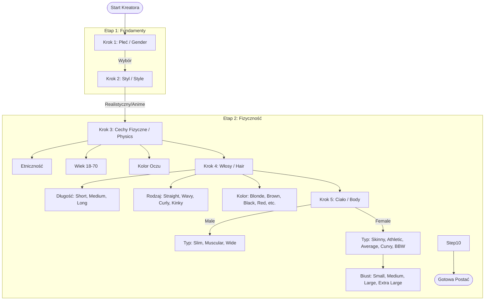

# Drzewo decyzyjne Kreatora Postaci (Neural Identity Forge)

Poniżej znajduje się schemat przepływu (flow) kreatora, który budujemy. Opiera się on na Twoich zrzutach ekranu i opisie.

## Szczegółowy opis kroków:

1.  **Gender (Płeć)**: Kobieta / Mężczyzna (Zrobione ✅)
2.  **Style (Styl)**: Realistyczny / Anime (Zrobione ✅)
3.  **Physics (Cechy)**: (Zrobione ✅)
    *   Etniczność: Caucasian, Latino, Asian, Arab, Black/Afro
    *   Wiek: Suwak 18-70
    *   Oczy: Brown, Blue, Green
4.  **Hair (Włosy)**: (W trakcie...)
    *   Style: Buzz cut, Long, Slicked Back, Short, Bun, Dreadlocks, Curly, Bald, Afro
    *   Kolory: Blonde, Brown, Black, Ginger, Gray, White, Pink
5.  **Body (Ciało)**:
    *   Typy: Slim, Muscular, Wide
6.  **Personality (Osobowość)**:
    *   Archetypy: Protector, Sage, Hero, Jester, Toy Boy, Dominant, Submissive, Lover, Beast, Confidant, Rebel, Scholar
    *   Głos: Voice 1-9
7.  **Pose (Poza)**: Wybór pozycji postaci.
8.  **Outfit (Ubiór)**: Wybór ubrania.
9.  **Location (Miejsce)**: Tło/Otoczenie.
10. **Summary (Podsumowanie)**: Podgląd i generacja.

Czy ten plan zgadza się z Twoją wizją? Jeśli tak, przechodzę do kodowania Kroku 4 (Włosy).
